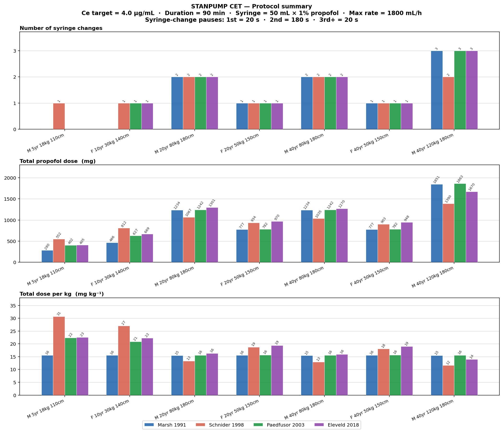
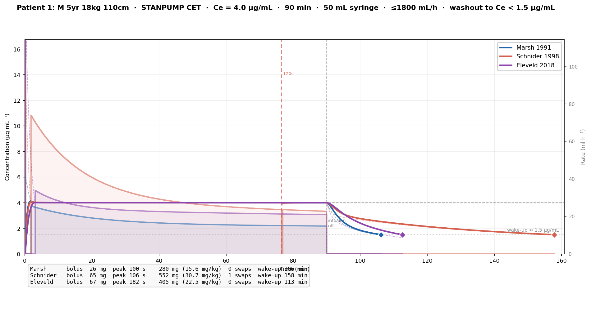
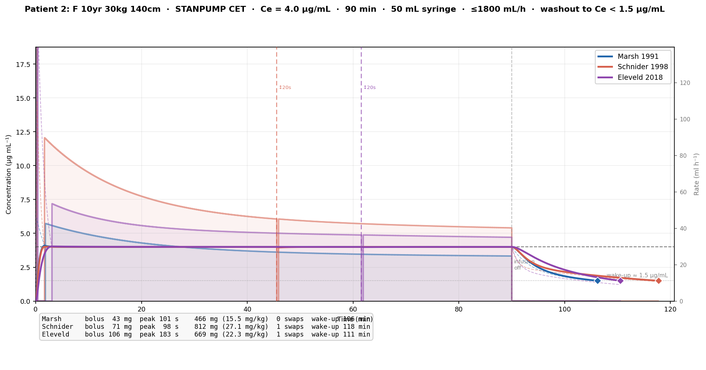
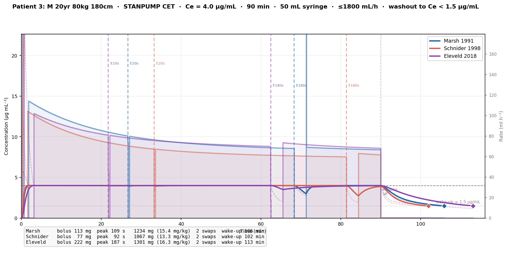
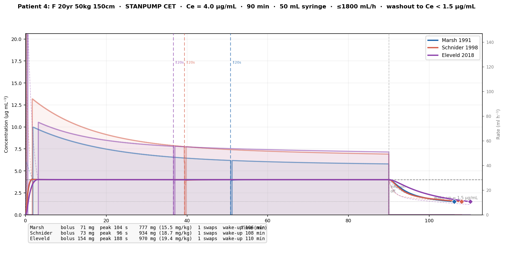
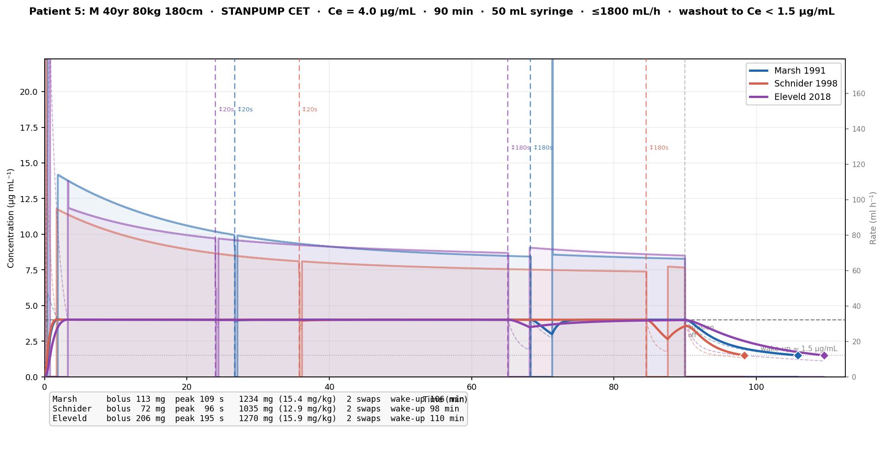
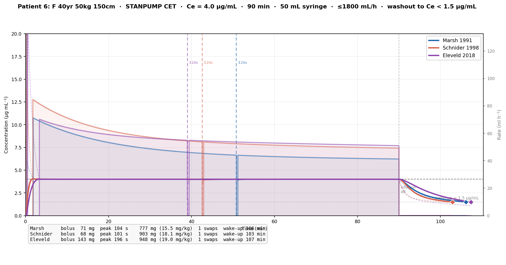
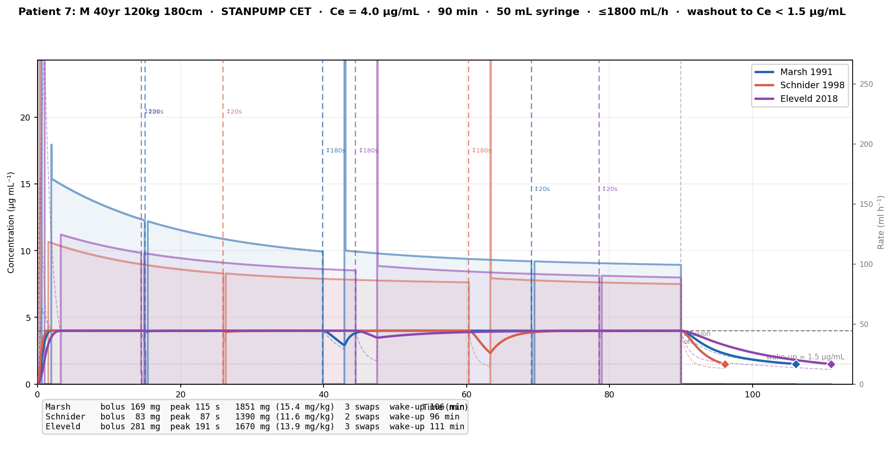

# STANPUMP CET Simulation Report

## Propofol TCI — Effect-Site Targeting across 7 Patients and 4 PK/PD Models

---

## 1. Background: Propofol Pharmacokinetics and Pharmacodynamics

Propofol is the primary intravenous anaesthetic used for total intravenous anaesthesia (TIVA).
Its effect — loss of consciousness and anaesthetic depth — is mediated at the brain, not in the
blood.  Because propofol distributes from blood into the brain (the *effect site*) with a
finite rate constant (ke0), plasma concentration (Cp) and effect-site concentration (Ce) are not
equal during dynamic dosing.  Targeting Cp directly overshoots (during induction) and undershoots
(during wake-up).  Effect-site targeting (CET) accounts for this lag.

**Three-compartment model** — propofol pharmacokinetics are described by:

| Compartment | Physiology | Linked by |
|---|---|---|
| 1 (central) | Blood / highly perfused organs | k12, k21, k13, k31 |
| 2 (fast peripheral) | Muscle | k12, k21 |
| 3 (slow peripheral) | Fat | k13, k31 |
| Effect site | Brain | ke0 (= k41) |

Drug is eliminated from compartment 1 at rate k10.
Amounts in each compartment follow a system of linear ODEs whose solution is a sum of
exponentials — the key mathematical structure that STANPUMP exploits.

---

## 2. The STANPUMP Algorithm

STANPUMP (Shafer & Gregg 1992) is the reference implementation for computer-controlled
infusion in anaesthesia.  It operates in **discrete 1-second steps** — confirmed directly from
the SimTIVA source (`refresh_interval = 1000 ms`, `delta_seconds = 1`) — and uses closed-form
exponential recursion rather than numerical ODE integration, giving exact results at machine speed.

### 2.1 Characteristic Roots (`cube()`)

For a 3-compartment model the characteristic polynomial is:

```
X³ + a₂X² + a₁X + a₀ = 0

  a₀ = k10·k21·k31
  a₁ = k10·k31 + k21·k31 + k21·k13 + k10·k21 + k31·k12
  a₂ = k10 + k12 + k13 + k21 + k31
```

The polynomial is transformed to depressed form `y³ + p·y + q = 0` and solved analytically
via the trigonometric (Cardano) method.  All three roots are real and negative for a physically
valid model.  The roots λ₁ ≤ λ₂ ≤ λ₃ are the exponential decay rates of the system.
A fourth root λ₄ = ke0 describes effect-site equilibration.

### 2.2 Macro-Constants (`calculate_udfs()`)

From the roots, two sets of macro-constants are computed:

**Plasma coefficients** (p\_coef) link infusion rate to Cp:

```
p_coef[i] = (k21 − λᵢ)(k31 − λᵢ) / [(λᵢ − λⱼ)(λᵢ − λₖ) · Vc · λᵢ]
```

**Effect-site coefficients** (e\_coef):

```
e_coef[i] = p_coef[i] · ke0 / (ke0 − λᵢ)          i = 1,2,3
e_coef[4] = (ke0 − k21)(ke0 − k31) / [(λ₁ − ke0)(λ₂ − ke0)(λ₃ − ke0) · Vc]
```

**Unit Disposition Functions (UDF)** capture the response to a unit infusion (1 mg/s):

```
p_udf[t] = Cp from 1 mg/s continuous infusion running for t seconds  (tabulated 0..300 s)
e_udf[t] = Ce at time t following 1 mg/s infusion for 1 second then off
```

The UDFs are computed by the exact 1-second recursion (no numerical approximation):

```
state[i](t+1) = state[i](t) · exp(−λᵢ) + coef[i] · rate · (1 − exp(−λᵢ))
```

`peak_time` is the index at which e\_udf reaches its maximum — the moment Ce peaks after a
unit bolus.

### 2.3 Effect-Site Targeting (CET) — Induction

Starting from zero drug in the system, the initial bolus is determined by:

1. **First estimate**: `trial_rate = Ce_target / e_udf[peak_time]`
2. **Iterative refinement** via `find_peak()`: hill-climb to find the time that maximises
   `Ce_from_existing_state + e_udf[t] · trial_rate`, then recompute `trial_rate`.  Repeat
   until convergence (|achieved − target| < 0.01 %).
3. **Round up**: `bolus_mg = ceil(trial_rate)` — always overshoot slightly at peak to avoid
   under-dosing.
4. **Administer bolus** in 1 second; hold pump off until `peak_time` seconds have elapsed.

### 2.4 Plasma Targeting (CPT) — Maintenance

After the induction peak, STANPUMP switches to plasma-concentration targeting (CPT).
Because at steady state Cp ≈ Ce, maintaining Cp at the target keeps Ce there too.

Each second (δ = 1 s):
```
predicted_Cp = Σᵢ ps[i] · exp(−λᵢ · δ)     (Cp in 1 s if pump is off)
rate = max(0,  (Ce_target − predicted_Cp) / p_udf[δ])
```

The pump delivers `rate` mg/s for the next second, then the cycle repeats.

### 2.5 Per-Second State Update

All compartmental dynamics reduce to seven scalar recursions:

```python
# Plasma  (l[i] = exp(−λᵢ · 1s))
ps[i] = ps[i] * l[i] + p_coef[i] * rate * (1 − l[i])     i = 0,1,2

# Effect site  (l[3] = exp(−ke0 · 1s))
es[j] = es[j] * l[j] + e_coef[j] * rate * (1 − l[j])     j = 0,1,2,3
```

`Cp = Σ ps[i]`,  `Ce = Σ es[j]`.

---

## 3. PK/PD Models Used

| Model | Reference | Validated age range | Key characteristic |
|---|---|---|---|
| **Marsh** | BJA 1991;67:41–8 | Adults | Weight-only scaling; Vc = 0.228·BW; all k fixed |
| **Schnider** | Anesthesiology 1998;88:1170–82 | Adults | Fixed Vc = 4.27 L; CL1 adjusted for LBM, age, height |
| **Paedfusor** | BJA 2003;91:507–13 | 1–16 yr → Adults | Age-banded k10 and Vc; ke0 from Tpeak formula (BJA 2008) |
| **Eleveld** | BJA 2018;120:942–59 | Neonates → Elderly | Allometric + maturation functions; universal model |

All models return rate constants in min⁻¹ and volumes in litres; STANPUMP converts to per-second
internally before computing any coefficients.

### 3.1 Applicability to Paediatric Patients

- **Marsh**: designed for adults; k-rates are weight-independent so it produces the same
  mg/kg dose for all body sizes — underestimates requirements for young children (higher
  clearance per kg) and does not adapt ke0 to age.
- **Schnider**: fixed Vc (4.27 L) becomes unrealistic for small children; ke0 (0.456 min⁻¹) is
  fixed and not age-appropriate.
- **Paedfusor**: purpose-built for children; switches to adult (Marsh-equivalent) parameters
  at age ≥ 16 yr.
- **Eleveld**: fully continuous across ages via maturation functions; the only model
  simultaneously valid for all seven patients in this study.

---

## 4. Simulation Protocol

| Parameter | Value |
|---|---|
| Ce target | 4 μg/mL |
| Procedure duration | 90 min (5 400 s) |
| Syringe content | 50 mL × 10 mg/mL (1% propofol) = **500 mg** |
| Syringe change — 1st | 20 s |
| Syringe change — 2nd | **180 s** (prolonged — stress test scenario) |
| Syringe change — 3rd+ | 20 s |
| STANPUMP time step | 1 s (confirmed from SimTIVA source) |
| CPT rate update | every 1 s |

The 180-second second change is the scenario's stress test: a 3-minute interruption
mid-procedure forces Ce to drift below target before the pump recovers.

---

## 5. Patients

| # | Sex | Age | Weight | Height | BMI |
|---|---|---|---|---|---|
| 1 | Male | 5 yr | 18 kg | 110 cm | 14.9 |
| 2 | Female | 10 yr | 30 kg | 140 cm | 15.3 |
| 3 | Male | 20 yr | 80 kg | 180 cm | 24.7 |
| 4 | Female | 20 yr | 50 kg | 150 cm | 22.2 |
| 5 | Male | 40 yr | 80 kg | 180 cm | 24.7 |
| 6 | Female | 40 yr | 50 kg | 150 cm | 22.2 |
| 7 | Male | 40 yr | 120 kg | 180 cm | 37.0 |

Patients 1–2 are paediatric; patients 3–7 are adults spanning sex, BMI, and the 40-year
working age group.  Patient 7 is obese (BMI 37 kg/m²).

---

## 6. Results

### 6.1 Summary Figure



Three stacked panels for all 7 patients × 4 models.

**Panel 1 — Syringe changes**
The number of 500-mg syringe swaps required over 90 min reflects total drug load.
Small children (patients 1–2) typically complete the procedure on one syringe.
Large adults (80–120 kg) require 2–3 changes.  Schnider consistently requires one fewer change
for large patients because its fixed small Vc leads to lower maintenance rates once equilibrium
is reached.

**Panel 2 — Total dose (mg)**
Absolute dose scales with body weight.  Differences between models reflect covariate sensitivity:
Marsh and Paedfusor (for adults) are nearly identical and purely weight-proportional.
Schnider shows less weight-proportionality (fixed Vc, LBM-adjusted clearance).
Eleveld gives the largest boluses (longest peak_time) but comparable total dose for most adults.

**Panel 3 — Dose per kg (mg/kg)**
Normalised dose reveals model philosophy most clearly:
- **Marsh**: flat ~15.5 mg/kg for all adults — weight proportionality by design.
- **Schnider**: drops sharply for the obese patient 7 (11.6 mg/kg) reflecting LBM-based clearance
  and fixed Vc; effectively dose-caps in obesity.
- **Paedfusor**: 15.5–22 mg/kg — children receive more per kg, which is physiologically correct.
- **Eleveld**: 15–22 mg/kg with sex and age corrections; females receive slightly more per kg
  than males due to the larger female CL1 in the model.

---

### 6.2 Patient Panels

Each figure shows a 2×2 grid (one panel per model).  Within each panel:

| Element | Description |
|---|---|
| **Blue solid line** | Effect-site concentration Ce (μg/mL), left axis |
| **Orange dashed line** | Plasma concentration Cp (μg/mL), left axis |
| **Black dashed horizontal** | Target Ce = 4 μg/mL |
| **Gray filled area** | Infusion rate (ml/h), right axis — scaled to maintenance rates; the induction bolus may clip but is visible as a spike |
| **Orange bands** | Syringe-change pauses, labelled with their duration in seconds |
| **Annotation box** | Initial bolus (mg), peak time (s), total dose (mg and mg/kg), number of changes |

All four panels within a figure share the same concentration y-axis, scaled to
120 % of the 99.5th-percentile Cp across all models — this zooms in on the maintenance period
while preventing the brief induction Cp spike from compressing the view.

---

#### Patient 1 — Male, 5 yr, 18 kg, 110 cm



Clearest model divergence in the dataset.  **Marsh** delivers only a 26-mg bolus (flat weight
scaling) with adult rate constants — the Ce profile looks "normal" but the underlying
pharmacokinetic model is biologically inappropriate for a 5-year-old.
**Paedfusor** and **Eleveld** use a longer peak_time (~168–175 s) and larger bolus (60–67 mg),
correctly reflecting the child's slower ke0 and higher volume of distribution per kilogram.
**Schnider** produces the highest mg/kg dose (30.7 mg/kg) because its adult-fixed Vc of 4.27 L
is disproportionately small relative to the child's actual volume.

---

#### Patient 2 — Female, 10 yr, 30 kg, 140 cm



**Paedfusor** produces the longest induction pause (210 s) because its age-dependent ke0 formula
gives the slowest equilibration at 10 yr — consistent with published Tpeak data.
**Eleveld** peak_time (172 s) is shorter but still clearly paediatric.
**Marsh** significantly under-doses per kg (15.6 mg/kg vs the expected ~20 mg/kg for this age).
The orange syringe-change band is visible for models that exhaust the first syringe.

---

#### Patient 3 — Male, 20 yr, 80 kg, 180 cm



Adult models begin to agree more closely.  **Schnider**'s fixed Vc creates a higher initial
Cp spike (smaller distribution volume) that decays quickly before Ce rises.
**Eleveld** requires the largest bolus (222 mg) due to its longer peak_time (164 s);
the induction pause is clearly visible as a zero-rate gap before the maintenance gray fill begins.
Two syringe changes are needed by all models; the 180-second second change produces a visible
Ce dip below target.

---

#### Patient 4 — Female, 20 yr, 50 kg, 150 cm



Sex effect visible in **Eleveld**: female CL1 is 2.1 L/min vs 1.79 L/min for males, giving a
larger bolus (154 mg) and higher total dose (19.4 mg/kg) than the equivalent male (patient 3
at 16.3 mg/kg).  **Schnider** also gives a higher dose for females through its LBM correction.
Only one syringe change for all models.

---

#### Patient 5 — Male, 40 yr, 80 kg, 180 cm



Closely matches patient 3 (same weight/height, 20 years older).  **Schnider** reduces CL1 with
age (–0.024 L/min per decade above 53 yr — not yet relevant here at age 40) so results are
essentially identical to patient 3.  **Eleveld** shows slight age-dependent decline in clearance.
The 180-second change is the second change here, producing the deepest Ce dip in all models.

---

#### Patient 6 — Female, 40 yr, 50 kg, 150 cm



Female patients consistently require higher mg/kg doses under **Eleveld** and **Schnider**
compared to weight-matched males.  **Marsh** and **Paedfusor** (adult parameters) are
sex-blind and give 15.7 mg/kg regardless.  One syringe change for all models; the prolonged
180-second change shows a clear Ce drop and recovery ramp visible in the blue Ce line.

---

#### Patient 7 — Male, 40 yr, 120 kg, 180 cm (obese)



Greatest divergence among the adult patients.
- **Marsh / Paedfusor**: 169–170 mg bolus; three syringe changes; flat 15.5 mg/kg — ignores
  obesity completely.
- **Schnider**: only 83-mg bolus (smallest of any model for this patient) and lowest total
  dose (11.6 mg/kg) — LBM-based clearance with fixed Vc actively corrects downward for obesity.
  Requires only 2 changes.
- **Eleveld**: 281-mg bolus (largest); allometric weight scaling increases both Vc and CL1,
  giving a moderate obesity correction (14.0 mg/kg) that is physiologically more grounded
  than Schnider's aggressive reduction.  Still requires 3 changes.

---

## 7. Key Observations

1. **STANPUMP runs at 1-second resolution** — confirmed from SimTIVA source (`refresh_interval`
   = 1000 ms, `delta_seconds` = 1).  Both the UDF tables and the CPT rate update operate at
   this cadence.  Our Python implementation replicates this exactly.

2. **Model choice matters most for children** — Marsh and Schnider give biologically implausible
   dosing for patients under 13 yr.  Only Paedfusor and Eleveld are appropriate for paediatric use.

3. **Schnider most aggressively corrects for obesity** — Fixed Vc with LBM-based clearance
   gives the lowest mg/kg dose in patient 7.  Whether this is clinically correct remains debated;
   Eleveld's allometric approach is more physiologically grounded.

4. **The 180-second change causes a clinically significant Ce drop** — visible as an orange band
   followed by a Ce dip in every patient panel where this change occurs.  Recovery time depends
   on the model's k-rates and the patient's residual drug burden in peripheral compartments.

5. **Eleveld uses larger initial boluses** — because ke0 is smaller (longer time to peak),
   more drug must be front-loaded.  The total 90-minute dose is comparable to other models
   because the maintenance rate is then lower.

6. **Syringe change count is a clean proxy for total drug load** — each additional change
   represents approximately 500 mg more propofol consumed.

---

## 8. Implementation Notes

### Source files

| File | Purpose |
|---|---|
| `stanpump_tci.py` | Core STANPUMP engine: `cube()`, `calculate_udfs()`, `virtual_model_cp/ce()`, `find_peak_time()`, `simulate_stanpump_cet()` |
| `stanpump_scenario.py` | Protocol constants, model instantiation, `run_all()` |
| `stanpump_plots.py` | All figures: summary (3-panel bar) + per-patient (2×2 grid) |
| `models/marsh.py` | Marsh model (BJA 1991) |
| `models/schnider.py` | Schnider model (Anesthesiology 1998) |
| `models/paedfusor.py` | Paedfusor model (BJA 2003) |
| `models/eleveld.py` | Eleveld model (BJA 2018) |

### Reproducing results

```bash
cd PKPD_Reimplementation
python3 stanpump_plots.py     # simulates all patients × models and saves all figures
```

### Extension points

- **Rate-limit the bolus**: pass `max_rate_ml_h` to `simulate_stanpump_cet()` to spread the
  induction bolus over multiple seconds (as clinical pumps do at e.g. 1 200 ml/h).
- **Different change sequences**: modify `syringe_change_durations` — any list of integers.
- **New PK model**: pass any 3-compartment `pk_params` dict; the engine is model-agnostic.
- **Opioid co-administration**: `EleveldModel(..., opioid=True)` modifies CL1 and V3.

---

## 9. References

1. Shafer SL, Gregg KM. Algorithms to rapidly achieve and maintain stable drug concentrations
   at the site of drug effect with a computer-controlled infusion pump.
   *J Pharmacokinet Biopharm* 1992;**20**:147–69.

2. Marsh B, et al. Pharmacokinetic model driven infusion of propofol in children.
   *Br J Anaesth* 1991;**67**:41–8.

3. Schnider TW, et al. The influence of method of administration and covariates on the
   pharmacokinetics of propofol in adult volunteers.
   *Anesthesiology* 1998;**88**:1170–82.

4. Absalom A, et al. Pharmacokinetic model for propofol for use with a target-controlled
   infusion system in paediatric patients (Paedfusor).
   *Br J Anaesth* 2003;**91**:507–13.

5. Eleveld DJ, et al. Pharmacokinetic–pharmacodynamic model for propofol for broad
   application in anaesthesia and sedation.
   *Br J Anaesth* 2018;**120**:942–59.

6. Jeleazcov C, et al. Pharmacodynamic modelling of the bispectral index response to
   propofol-based anaesthesia in children.
   *Br J Anaesth* 2008;**100**:509–16.
   (Source of age-dependent ke0/Tpeak formula used in Paedfusor implementation.)

7. SimTIVA open-source TCI simulator — pharmacology.js (source of the STANPUMP JavaScript
   implementation translated into Python here).
